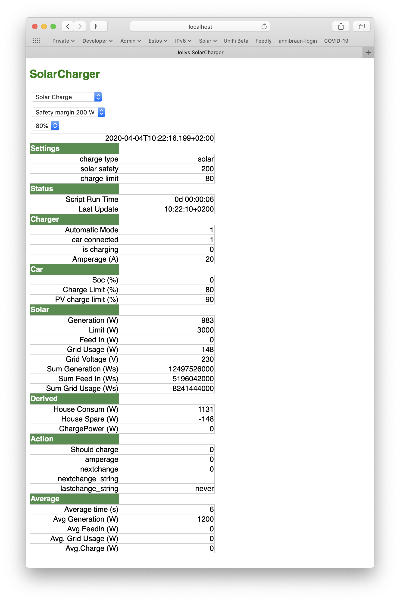
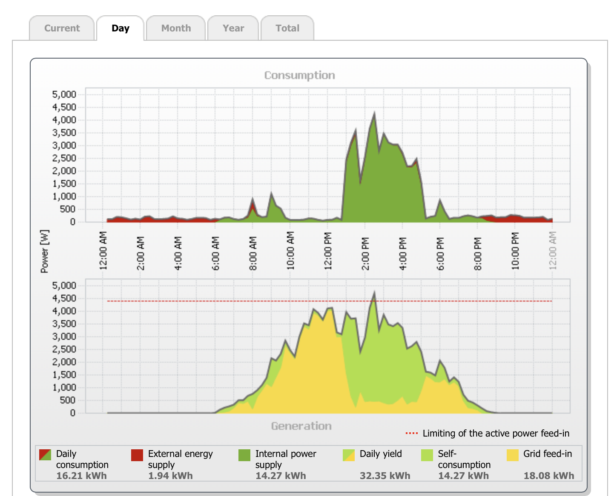

# SolarCharger
Charge your car when the sun shines enough and the house it not using too much.

The script reads the live values from the PV system and the House consumption ( SMA Sunnyboy and SMA Engery Meter) and sets the Phoenix charger to charge when there is enough power.

It furthermore generates a website (default is http://localhost:5145 ) which lets you set the default settings.

I do have a BMW and if that's hat home it only gets charged when it's below the full state. I do have a 70% feed in rule so I charge the car regardless of it's charging state if the solar system would be cut down to 70% otherwise. It will charge then with 6A and only until 90%.

## Configuration

Change the config.ini file to use the ipaddresses/names for your setup. Start the script for testing with perl startcharger.perl --help

## Website 

The generated website looks like this:

 

A typical day looks like:

 
